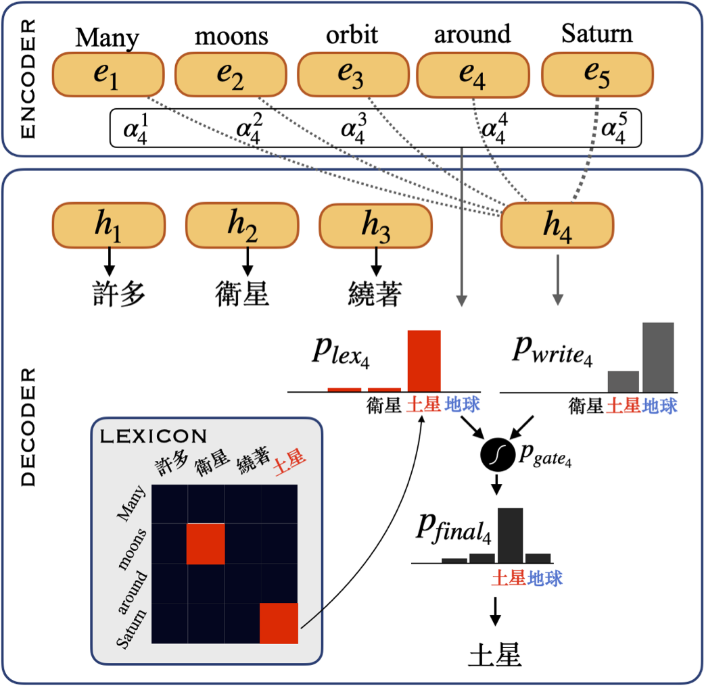

# Lexicon Learning for Few-Shot Neural Sequence Modeling
Paper: [Lexicon Learning for Few-Shot Neural Sequence Modeling](https://drive.google.com/file/d/1jDCXL4MT_rLN2X2QNHFae90r17w3HM3g/view?usp=sharing)    
Ekin Akyürek, Jacob Andreas ACL 2021




## Dependencies
- **OS**: Linux or macOS
- **Language**: Python
- **Hardware**:  NVIDIA GPU (CUDA and cuDNN)
- **Libraries**: PyTorch, numpy, nltk
- **Optional**:
  - Jupyter Notebook (Used for analysis of results.)


## Requirements

You can use provided [environment.yml](./environment.yml) to setup the required libraries using `conda` software.

### Info:

Exact versions of the important libraries I used for this project.   

1. python=3.7.3
2. pytorch=1.2.0 (cuda10.0.130_cudnn7.6.2_0)
3. numpy=1.19.1
5. nltk==3.5

Note that since this codebase is for reproducibility purposes you might require specific versions of the dependencies as described above. However, it should work with higher versions as well.

## Setup

You can setup this repo by typing below in shell:

```SHELL

git clone --recurse-submodules git://github.com/ekinakyurek/lexical.git
cd lexical
conda env create --file environment.yml # creates conda env with required packages
```

## Data

[COGS](./COGS) and [SCAN](./SCAN) datasets are provided as a submodule.   
[TRANSLATE](./TRANSLATE) and [COLOR](./COLOR) datasets are provided as a subfolder.


> 📋 See individual license files for each dataset under their folders.

## Training

To verify the results presented in the paper, you may run the scripts to train models and see the evaluations.

**Lexicon Learning (optional)**:

We provide the required lexicon files in the repo. For those who are interested in this part:

You need formatted training files with following structure ([ref](https://github.com/clab/fast_align))

> Each line is a source language sentence and its target language translation, separated by a triple pipe symbol with leading and trailing white space (|||).

Then you can extract all the lexicons by running the script:

```SHELL
sh extract_alignments.sh
```

**Seq2Seq Training**:

All experiment scripts are found at [exps/](exps/)

For example,

- To run the *simple* model on COGS dataset you can use:
```SHELL
cd exp/COGS
sh simple.sh $i #  $i is the seed of the experiments. You can use  `sbatch simple.sh` for running all exps parallel on slurm
```

- To run the *IBM2* model on COGS dataset you can use:
```SHELL
cd exp/COGS
sh fast.sh $i
```

The logs can be found in the created subfolders.

> 📋 Note that the experiments are tested on NVIDIA 32GB V100 Volta GPUs. For some models GPU requirements might be high.

> 📋 jump(SCAN) and Color experiments are very sensitive to seeds, so any change in the code might change the results sligthly.

## Evaluation

After running an experiment, evaluation results can be found under subfolders, we provide convenience scripts in each exp folder which collates the results in shell:

```SHELL
sh collect.sh   # (WIP: some of them needs to updated slightly)
```

After running all experiments, one can refer to `analyze.ipynb` Jupyter Notebook to obtain the figures and tables provided in the paper.

## Trouble Shooting

TODO
